# Tugas 1 Pemrograman Jaringan

## Soal
Tugas 1 :

Clone repository: https://github.com/rm77/progjar.git 

Dari direktori progjar1: 

* [Jalankan program server.py di 3 port yang berbeda (31000, 31001, 31002)](#Poin-1) 

* [Jalankan program client.py untuk konek ke server yang jalan pada poin sebelumnya dan mengirimkan string “PEMROGRAMAN JARINGAN TEKNIK INFORMATIKA”](#Poin-2) 

* [Jalankan program server.py di 3 port yang berbeda di 2 komputer yang berbeda](#Poin-3) 

* [Jalankan program client.py untuk konek ke server pada poin sebelumnya, kirimkan string yang sama](#Poin-4) 

* [Jalankan program server.py di 2 komputer yang berbeda, masing-masing 2 server di port yang berbeda](#Poin-5) 

* [MODIFIKASILAH program client.py dan server.py agar dapat MENTRANSFER file dari client ke server (letakkan program modifikasi di direktori tugas1a)](#nomor-1a) 

* [MODIFIKASILAH program server.py agar dapat mengirimkan MENTRANSFER FILE yang di request oleh client (letakkan program modifikasi di direktori tugas1b)](#nomor-1b) 

## Poin 1
Jalankan program server.py di 3 port yang berbeda (31000, 31001, 31002) 
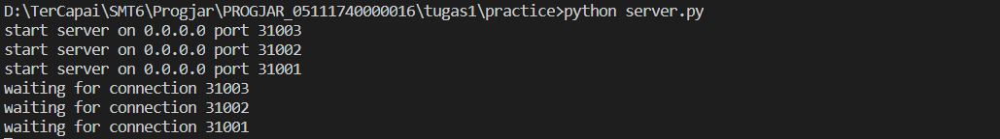
Menggunakan thread untuk menjalankan thread di 3 port berbeda

## Poin 2
Jalankan program client.py untuk konek ke server yang jalan pada poin sebelumnya dan mengirimkan string “PEMROGRAMAN JARINGAN TEKNIK INFORMATIKA” 
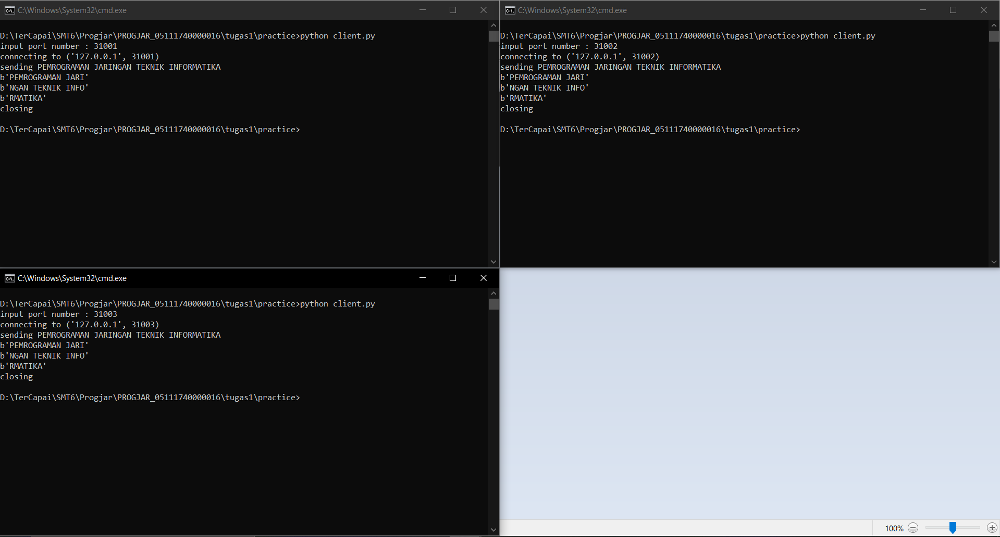
3 client konek di server yang sama
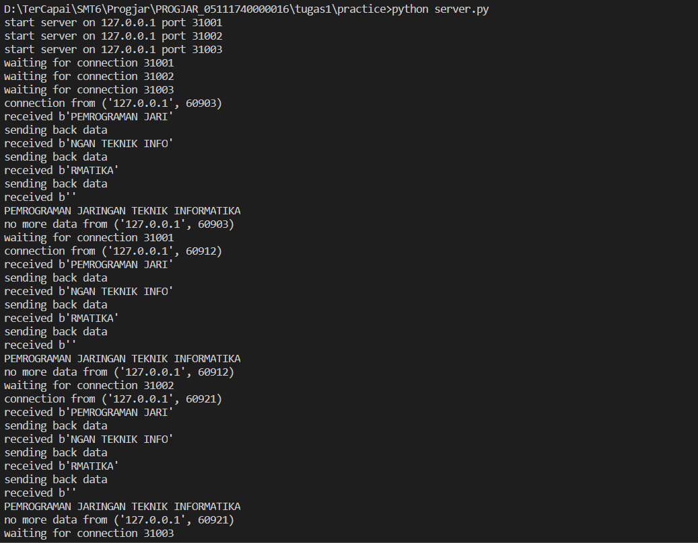
Server merespon 3 client

## Poin 3
Jalankan program server.py di 3 port yang berbeda di 2 komputer yang berbeda 
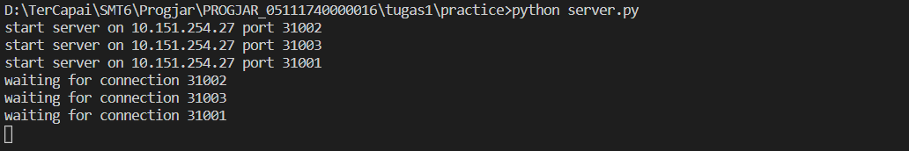
Server dijalankan pada 10.151.254.27
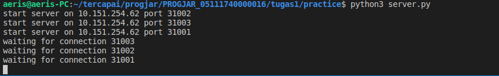
Server dijalankan pada 10.151.254.62

## Poin 4
Jalankan program client.py untuk konek ke server pada poin sebelumnya, kirimkan string yang sama 
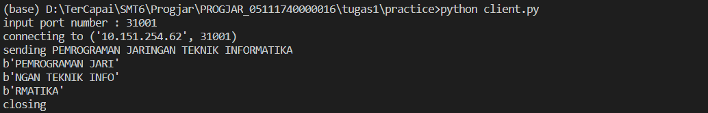
Client konek ke 10.151.254.62
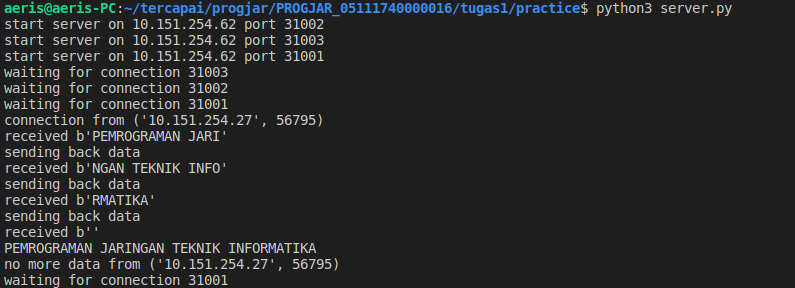
Respon dari server

## Poin 5
Jalankan program server.py di 2 komputer yang berbeda, masing-masing 2 server di port yang berbeda  
Sama dengan poin 3 

Server dijalankan pada 10.151.254.27

Server dijalankan pada 10.151.254.62

## Nomor 1a
MODIFIKASILAH program client.py dan server.py agar dapat MENTRANSFER file dari client ke server
1. Masuk ke direktori tugas1a
1. Jalankan server 
    ```py
    python server.py
    ```
    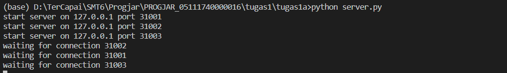
    Menjalankan server dan bisa diakses di 3 port berbeda
    
    Jika ada koneksi dari client
2. Jalankan client
    ```py
    python client.py
    ```
3. Masukkan informasi yang dibutuhkan (port server dan nama file yang dikirim)
    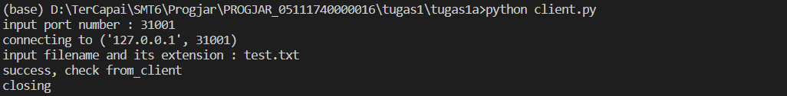
4. Bandingkan file yang dikirim dan diterima
    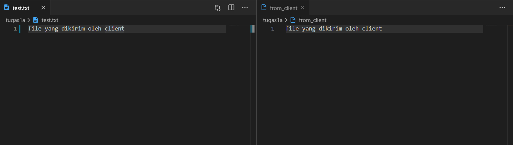
    File yang dikirim dan diterima sama

## Nomor 1b
1. Masuk ke direktori tugas1b
2. Jalankan server terlebih dahulu
    ```pyv
    python server.py
    ```
    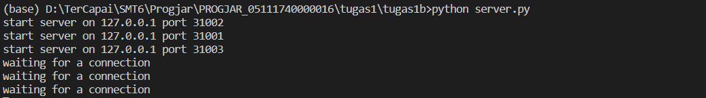
    Menjalankan server dan bisa diakses di 3 port berbeda
    
    Jika ada koneksi dari client
3. Jalankan client
    ```py
    python client.py
    ```
4. Masukkan informasi yang dibutuhkan (port server dan nama file yang direquest)
    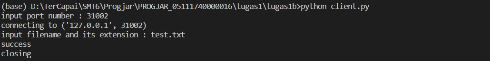
4. Bandingkan file yang dikirim dan diterima
    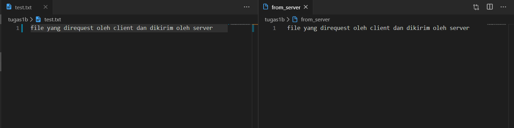
    File yang direquest dan diterima sesuai