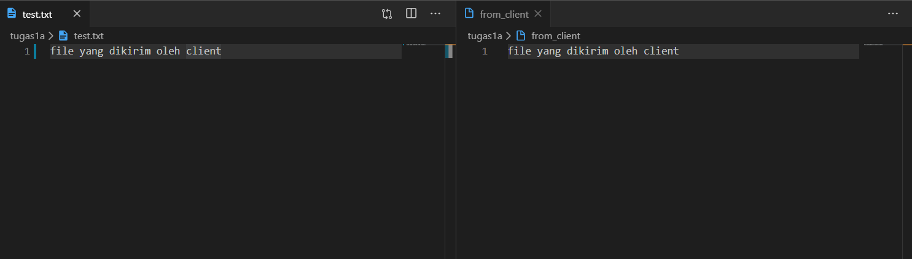

# Soal
MODIFIKASILAH program client.py dan server.py agar dapat MENTRANSFER file dari client ke server (letakkan program modifikasi di direktori tugas1a)

# Penggunaan
1. Jalankan server terlebih dahulu
    ```py
    python server.py
    ```
    
    Menjalankan server dan bisa diakses di 3 port berbeda
    
    Jika ada koneksi dari client
2. Jalankan client
    ```py
    python client.py
    ```
3. Masukkan informasi yang dibutuhkan (port dan nama file yang dikirim   oleh client)
    
4. Bandingkan file yang dikirim dan diterima
    
    File yang dikirim dan diterima sama


