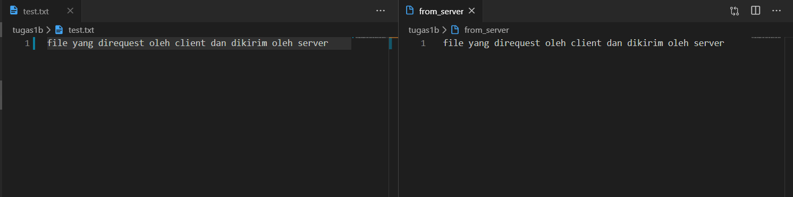

# Soal
MODIFIKASILAH program server.py agar dapat mengirimkan MENTRANSFER FILE yang di request oleh client (letakkan program modifikasi di direktori tugas1b)

# Penggunaan
1. Jalankan server terlebih dahulu
    ```pyv
    python server.py
    ```
    
    Menjalankan server dan bisa diakses di 3 port berbeda
    
    Jika ada koneksi dari client
2. Jalankan client
    ```py
    python client.py
    ```
3. Masukkan informasi yang dibutuhkan (port dan nama file yang dikirim oleh client)
    
4. Bandingkan file yang dikirim dan diterima
    
    File yang direquest dan diterima sesuai


