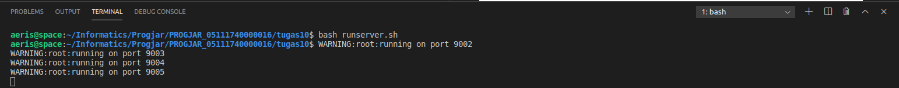

## Tugas 10 Pemrograman Jaringan

## Soal
1. Pull update terbaru
2. Jalankan async_server.py pada port 9002, 9003, 9004, 9005 (lihat pada BackendList)
3. Jalankan file lb.py, jalankan di port 44444
4. Jalankan browser, akseslah http://localhost:44444/page.html
5. Lihatlah di log program, bahwa setiap request akan dilayani oleh backend yang bergantian
6. Lakukan performance test seperti pada tugas 9, bandingkan penggunaan load balancer dengan async_server dengan server_thread_http pada folder progjar5
7. Buatlah tabel hasilnya

## Jalankan async_server.py pada port 9002, 9003, 9004, 9005
  
## Jalankan file lb.py, jalankan di port 44444
  
## Jalankan browser, akseslah http://localhost:44444/page.html
  
## Setiap request akan dilayani oleh backend yang bergantian
  
## Performance Test
### Async
* ab -n 1000 -c 1 -r -k -s 99999 http://127.0.0.1:44444/
  
* ab -n 1000 -c 10 -r -k -s 99999 http://127.0.0.1:44444/
  
* ab -n 1000 -c 50 -r -k -s 99999 http://127.0.0.1:44444/
  
* ab -n 1000 -c 100 -r -k -s 99999 http://127.0.0.1:44444/
  
### Thread
* ab -n 1000 -c 1 -r -k -s 99999 http://127.0.0.1:46000/
  
* ab -n 1000 -c 10 -r -k -s 99999 http://127.0.0.1:46000/
  
* ab -n 1000 -c 50 -r -k -s 99999 http://127.0.0.1:46000/
  
* ab -n 1000 -c 100 -r -k -s 99999 http://127.0.0.1:46000/
  
## Tabel
### Async + Load Balancer
| Concurrency level | Time taken for test (seconds) | Complete request | Failed request | Total transferred (bytes) | Request per second | Time per request (ms) | Transfer rate (Kbytes/sec) |
|:-----------------:|:-----------------------------:|:----------------:|:--------------:|:-------------------------:|:------------------:|:---------------------:|:--------------------------:|
|1|0.564|1000|0|122000|1774.46|0.564|211.41|
|10|0.253|1000|0|122000|3948.26|2.533|470.40|
|50|0.241|1000|0|122000|4152.10|12.042|493.68|
|100|0.243|1000|0|122000|4109.21|24.336|489.57|
### Thread
| Concurrency level | Time taken for test (seconds) | Complete request | Failed request | Total transferred (bytes) | Request per second | Time per request (ms) | Transfer rate (Kbytes/sec) |
|:-----------------:|:-----------------------------:|:----------------:|:--------------:|:-------------------------:|:------------------:|:---------------------:|:--------------------------:|
|1|133.395|1000|0|122000|7.50|133.395|0.89|
|10|166.772|1000|0|122000|6.00|1667.725|0.71|
|50|384.678|1000|276|111020|2.60|19233.908|0.28|
|100|368.850|1000|789|90646|2.76|362.84|0.24|
