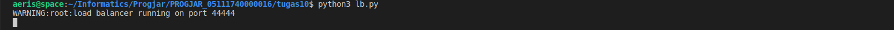
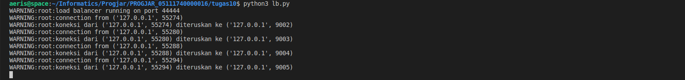

## Tugas 10 Pemrograman Jaringan

## Soal
1. Pull update terbaru
2. Jalankan async_server.py pada port 9002, 9003, 9004, 9005 (lihat pada BackendList)
3. Jalankan file lb.py, jalankan di port 44444
4. Jalankan browser, akseslah http://localhost:44444/page.html
5. Lihatlah di log program, bahwa setiap request akan dilayani oleh backend yang bergantian
6. Lakukan performance test seperti pada tugas 9, bandingkan penggunaan load balancer dengan async_server dengan server_thread_http pada folder progjar5
7. Buatlah tabel hasilnya

## Jalankan async_server.py pada port 9002, 9003, 9004, 9005
  
## Jalankan file lb.py, jalankan di port 44444
  
## Jalankan browser, akseslah http://localhost:44444/page.html
  
## Setiap request akan dilayani oleh backend yang bergantian
  
## Performance Test
### Async
* ab -n 1000 -c 1 -r -k -s 99999 http://127.0.0.1:44444/
  
* ab -n 1000 -c 10 -r -k -s 99999 http://127.0.0.1:44444/
  
* ab -n 1000 -c 50 -r -k -s 99999 http://127.0.0.1:44444/
  
* ab -n 1000 -c 100 -r -k -s 99999 http://127.0.0.1:44444/
  
### Thread
* ab -n 1000 -c 1 -r -k -s 99999 http://127.0.0.1:46000/
  
* ab -n 1000 -c 10 -r -k -s 99999 http://127.0.0.1:46000/
  
* ab -n 1000 -c 50 -r -k -s 99999 http://127.0.0.1:46000/
  
* ab -n 1000 -c 100 -r -k -s 99999 http://127.0.0.1:46000/
  
## Tabel
