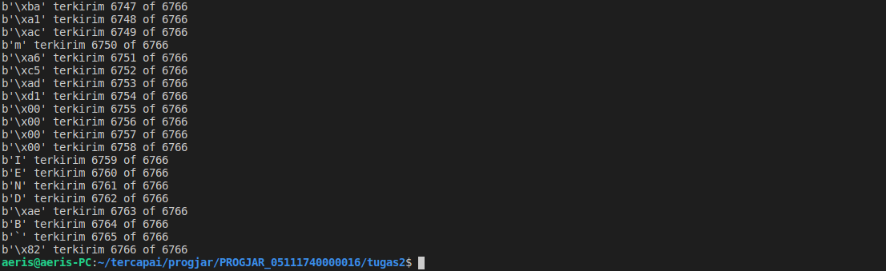
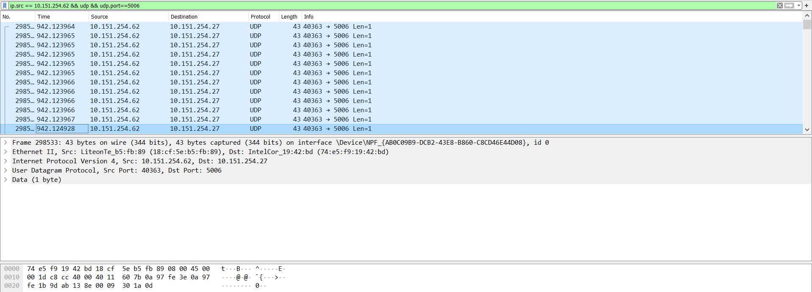
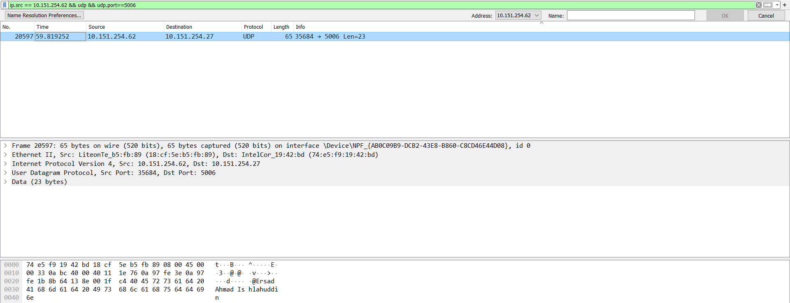
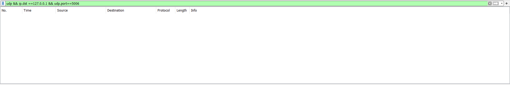
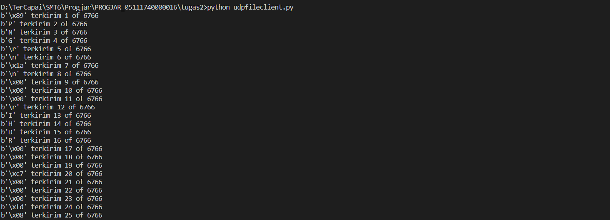
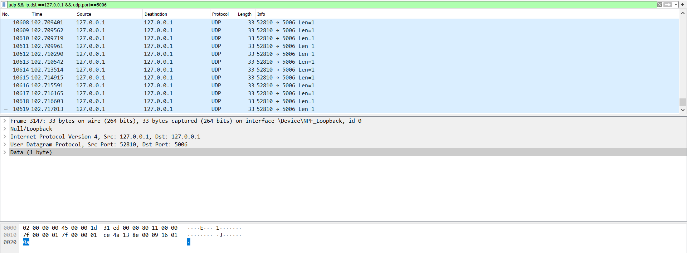
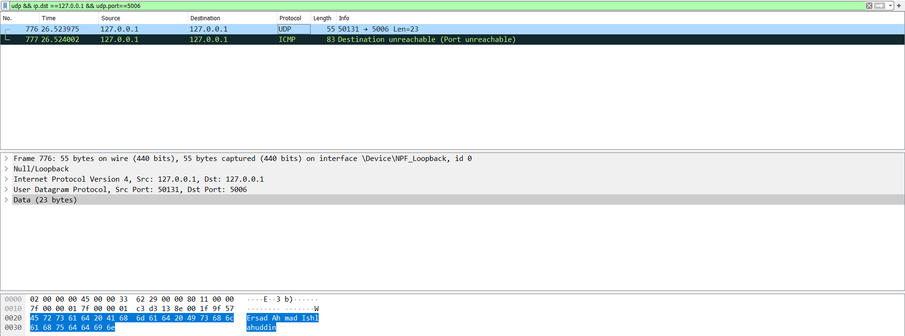

# Modifikasi
Paket dikirim dari komputer lain yang menuju ke komputer kita  
Dalam kasus ini IP receiver = 10.151.254.27 dan IP sender = 10.151.254.62  
## Nomor 1
### Hasil Keluaran dari program udpfileclient.py ke IP kita ke port 5006
1. Memilih capture file "wifi" pada wireshark, klik dua kali.
2. Mengatur filter pada wireshark agar hanya menangkap paket yang dari alamat IP sender menuju port 5006.
    ```
    ip.src == 10.151.254.62 && udp && udp.port==5006
    ```
3. Memodifikasi file udpfileclient.py agar mengarah ke alamat yang sesuai
    ```py
    TARGET_IP = "10.151.254.27"
    TARGET_PORT = 5006
    ```
4. Jalankan file udpfileclient.py
    ```
    python udpfileclient.py
    ```
    
5. Cek paket pada wireshark
    
    Bisa dilihat bahwa terdapat paket berukuran 1 byte sebanyak ukuran file ke alamat IP kita port 5006 dari IP tempat kita menjalankan udpfileclient.py

## Nomor 2
### Hasil Keluaran dari program udp_simple.py ke IP kita ke port 5006
1. Memilih capture file "wifi" pada wireshark, klik dua kali.
2. Mengatur filter pada wireshark agar hanya menangkap paket yang dari alamat IP sender menuju port 5006.
    ```
    ip.src == 10.151.254.62 && udp && udp.port==5006
    ```
3. Memodifikasi file udp_simple.py agar mengarah ke alamat yang sesuai dan pesan yang ingin dikirim
    ```py
    TARGET_IP = "10.151.254.27"
    TARGET_PORT = 5006

    message = "Ersad Ahmad Ishlahuddin"
    sock = socket.socket(socket.AF_INET, socket.SOCK_DGRAM)
    sock.sendto(bytes(message.encode()),(TARGET_IP,TARGET_PORT))
    ```
4. Jalankan file udp_simple.py
    ```
    python udp_simple.py
    ```
5. Cek paket pada wireshark
    
    Bisa dilihat bahwa terdapat paket yang berisi pesan yang terkirim sesuai ukurannya ke alamat IP kita port 5006 dari IP tempat kita menjalankan udp_simple.py

# Original
Menggunakan wireshark, capture :
1. Hasil Keluaran dari program udpfileclient.py ke alamat 127.0.0.1 ke port 5006
2. Hasil Keluaran dari program udp_simple.py ke alamat 127.0.0.1 di port 5006

## Nomor 1
### Hasil Keluaran dari program udpfileclient.py ke alamat 127.0.0.1 ke port 5006
1. Memilih capture file "Adapter for loopback traffic capture" pada wireshark, klik dua kali.
2. Mengatur filter pada wireshark agar hanya menangkap paket yang menuju alamat 127.0.0.1 port 5006.
    ```
    ip.src == 127.0.0.1 && ip.dst ==127.0.0.1 && udp.port==5006
    ```
    
3. Memodifikasi file udpfileclient.py agar mengarah ke alamat yang sesuai
    ```py
    TARGET_IP = "127.0.0.1"
    TARGET_PORT = 5006
    ```
4. Jalankan file udpfileclient.py
    ```
    python udpfileclient.py
    ```
    
5. Cek paket pada wireshark
    
    Bisa dilihat bahwa terdapat paket berukuran 1 byte sebanyak ukuran file ke alamat 127.0.0.1 port 5006

## Nomor 2
### Hasil Keluaran dari program udp_simple.py ke alamat 127.0.0.1 di port 5006
1. Memilih capture file "Adapter for loopback traffic capture" pada wireshark, klik dua kali.
2. Mengatur filter pada wireshark agar hanya menangkap paket yang menuju alamat 127.0.0.1 port 5006.
    ```
    udp && ip.dst ==127.0.0.1 && udp.port==5006
    ```
    
3. Memodifikasi file udp_simple.py agar mengarah ke alamat yang sesuai dan pesan yang ingin dikirim
    ```py
    TARGET_IP = "127.0.0.1"
    TARGET_PORT = 5006

    message = "Ersad Ahmad Ishlahuddin"
    sock = socket.socket(socket.AF_INET, socket.SOCK_DGRAM)
    sock.sendto(bytes(message.encode()),(TARGET_IP,TARGET_PORT))
    ```
4. Jalankan file udp_simple.py
    ```
    python udp_simple.py
    ```
5. Cek paket pada wireshark
    
    Bisa dilihat bahwa terdapat paket yang berisi pesan yang terkirim sesuai ukurannya