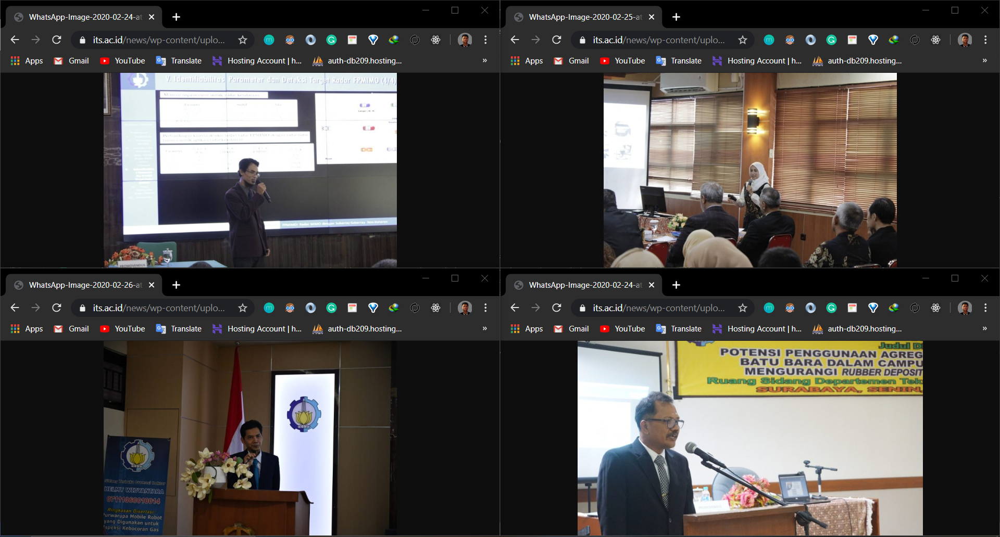
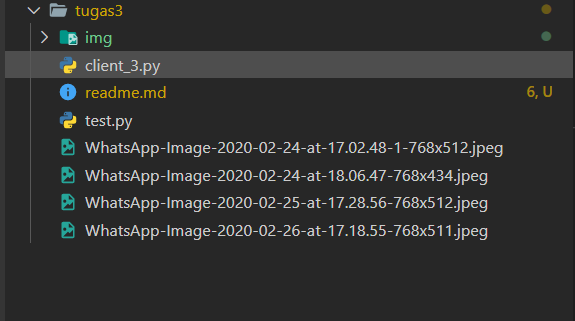

# Tugas 3

Download gambar menggunakan thread (modifikasi dari client_3.py)


Gambar yang akan didownload

## Modifikasi file client_3.py
```py
    listImages = [
        "https://www.its.ac.id/news/wp-content/uploads/sites/2/2020/02/WhatsApp-Image-2020-02-26-at-17.18.55-768x511.jpeg",
        "https://www.its.ac.id/news/wp-content/uploads/sites/2/2020/02/WhatsApp-Image-2020-02-25-at-17.28.56-768x512.jpeg",
        "https://www.its.ac.id/news/wp-content/uploads/sites/2/2020/02/WhatsApp-Image-2020-02-24-at-18.06.47-768x434.jpeg",
        "https://www.its.ac.id/news/wp-content/uploads/sites/2/2020/02/WhatsApp-Image-2020-02-24-at-17.02.48-1-768x512.jpeg"
    ]
```
Memasukkan url gambar ke dalam list, yang kemudian akan diiterasi
```py
    threads = []
    for image in listImages:
        t = threading.Thread(target=download_gambar,args=(image,))
        threads.append(t)

    for thr in threads:
        thr.start()
```
Memasukkan fungsi download ke dalam thread

## Output gambar yang telah didownload

