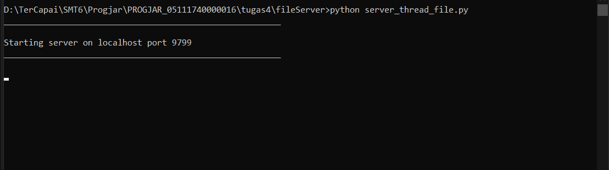
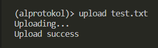
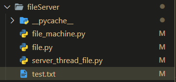
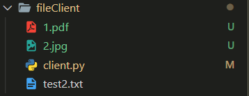
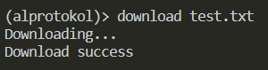
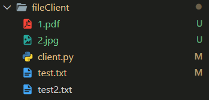
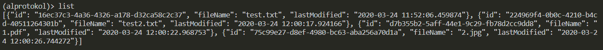

## Tugas 4 Pemrograman Jaringan

## Soal


----

## Keterangan
----
- Folder `fileServer` digunakan untuk menyimpan file-file yang berhubungan dengan server.
- File [**`server_thread_file.py`**](fileServer/server_thread_file.py) digunakan sebagai server untuk menangani perintah dari client.
- File [**`file_machine.py`**](fileServer/file_machine.py) digunakan sebagai penghubungan antara database dan request.
- File [**`file.py`**](fileServer/file.py) digunakan untuk menangangi operasi-operasi dalam database.
----
- Folder `fileClient` digunakan untuk menyimpan file-file yang berhubungan dengan client.
- File [**`client.py`**](fileClient/client.py) digunakan sebagai client untuk memasukkan perintah yang akan dikirim ke server.
----
- Folder `db` digunakan untuk menyimpan file-file yang berhubungan dengan database.

## Ketentuan Membaca Format

Ketentuan yang digunakan dalam client adalah string dengan format

```
[command] [value]
```

- **`[command]`** merupakan fungsi yang disediakan program.
- **`[value]`** berupa nama file yang hendak dikenakan perintah/operasi.

File yang telah diupload pada akan disimpan dalam bentuk JSON dengan format:

- ID
- File Name
- Last Modified

## Daftar Fitur, Cara Request dan Respon

**Catatan**
- **Semua fitur digabung dalam 1 client yang sama, tergantung pada commandnya**
- **Nyalakan server terlebih dahulu sebelum memulai protokol**
    

Daftar fitur yang tersedia:

- ### Meletakkan File (Upload)

    - Deskripsi  
    Fitur ini memperbolehkan client untuk upload sebuah file ke server. File yang diupload akan mempunyai nama dan ekstensi yang sama  
    File yang akan diupload harus ada di direktori fileClient dan file yang telah diupload akan disimpan di dalam direktori fileServer  
    - Cara Request  
    Command: **`upload`**<br>
    Value: File yang akan diupload<br>
    ```
    (alprotokol)> upload [fileName]
    ```
    - Response  
    Jika sukses **Upload Success**. Jika gagal **Error**
    - Contoh  
    Jalankan perintah  
      
      
    test.txt telah bertambah di fileServer

- ### Mengambil File (Download)

    - Deskripsi  
    Fitur ini memperbolehkan client untuk download sebuah file dari server. File yang didownload akan mempunyai nama dan ekstensi yang sama  
    File yang akan diupload harus ada di direktori fileServer dan file yang telah didownload akan disimpan di dalam direktori fileClient.  
    - Cara Request  
    Command: **`download`**<br>
    Value: File yang akan didownload<br>
    ```
    (alprotokol)> download [fileName]
    ```
    - Response  
    Jika sukses **Download Success**. Jika gagal **Error**
    - Contoh  
    Hapus terlebih dahulu file test.txt yang telah didownload tadi  
      
    Jalankan perintah  
      
      
    test.txt telah bertambah di fileClient  


- ### Melihat Daftar File

    - Deskripsi  
    Fitur ini memperbolehkan client untuk melihat daftar file yang ada di dalam server (direktori fileServer)
    - Cara Request  
    Command: **`list`**<br>
    ```
    (alprotokol)> list
    ```
    - Response  
    Jika sukses **JSON Daftar FIle**. Jika gagal **Error**
    - Contoh  
      
    Terdapat 4 file di dalam server
