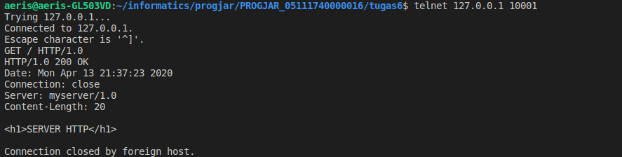
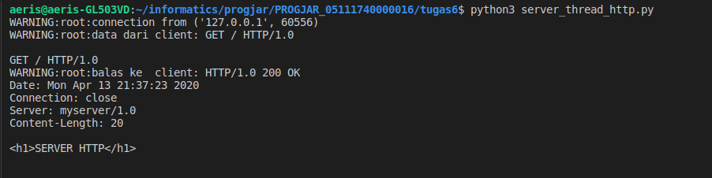
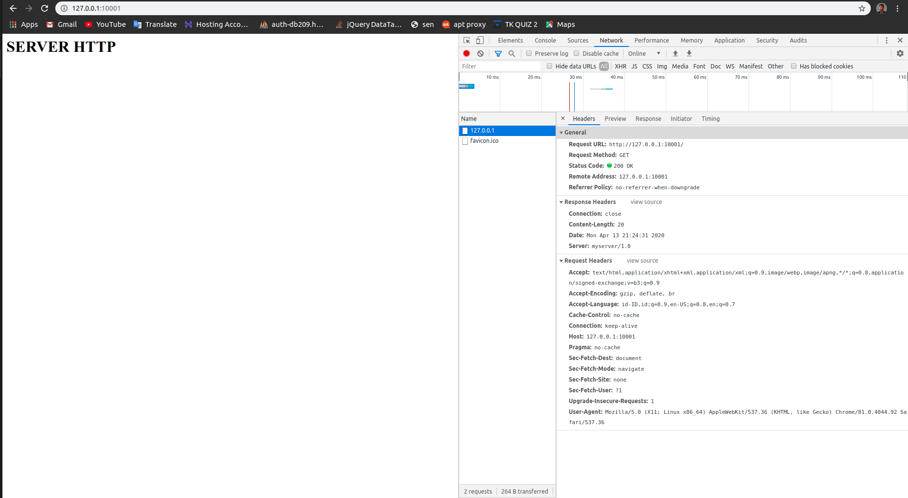
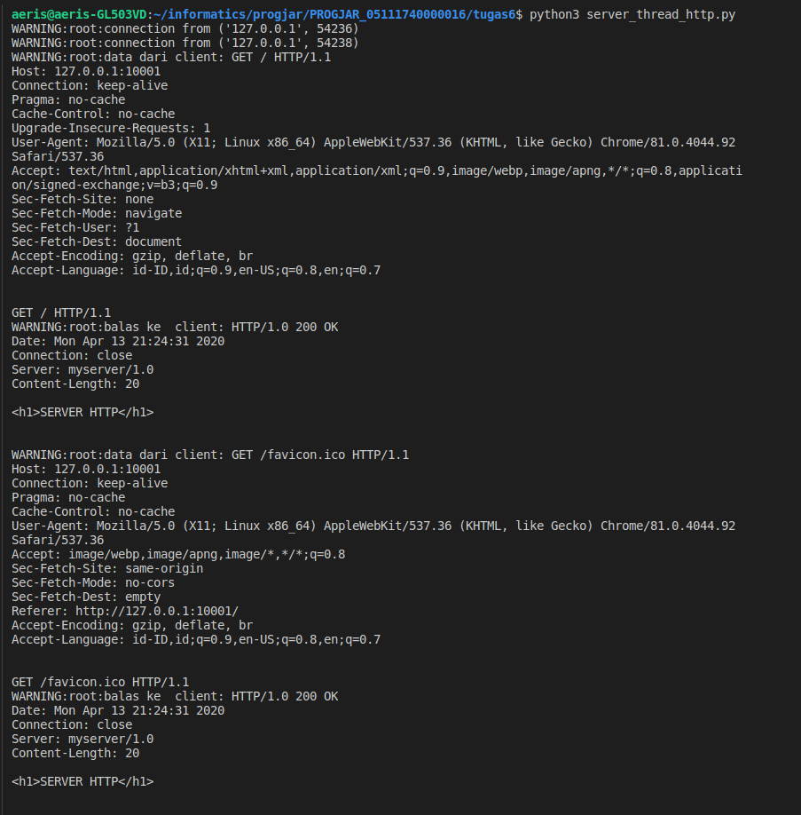
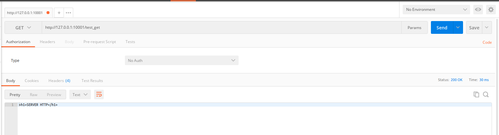
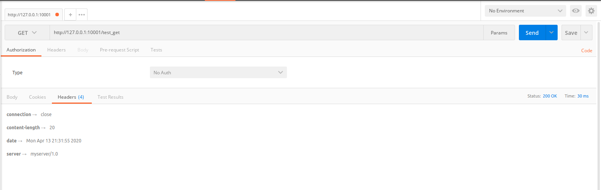
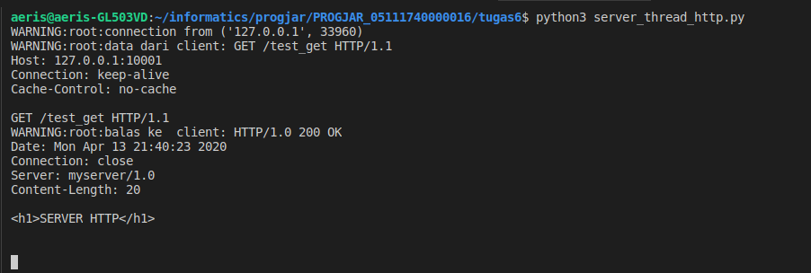

## Tugas 6 Pemrograman Jaringan

## Soal

Buatlah
1. Sebuah multithreaded server, buka pada port 10001 di ip address 127.0.0.1
2. Dapat melayani request dalam bentuk string seperti ini
`GET spasi / spasi HTTP/1.0` 
3. Tanda akhir request adalah “\r\n\r\n”
4. Jika tanda akhir request diterima, maka balaslah dengan string 
“`<h1>SERVER HTTP</h1>`”
5. Cobalah dengan telnet pada port 10001, dengan cara mengirimkan string 
`GET<spasi>/<spasi>HTTP/1.0<enter><enter>`
Harusnya mereply dengan yang sama pada point nomor 4
6. Bukalah chrome web browser, aktifkan developer mode, bagian network
7. bukalah alamat http://127.0.0.1:10001
8. Screenshot-lah tampilannya
9. Kirimkan ke asisten

## Menggunakan Telnet
### Request

### Server

## Menggunakan Browser + Developer Mode
### Request

### Server

## Menggunakan Postman
### Request

### Server
