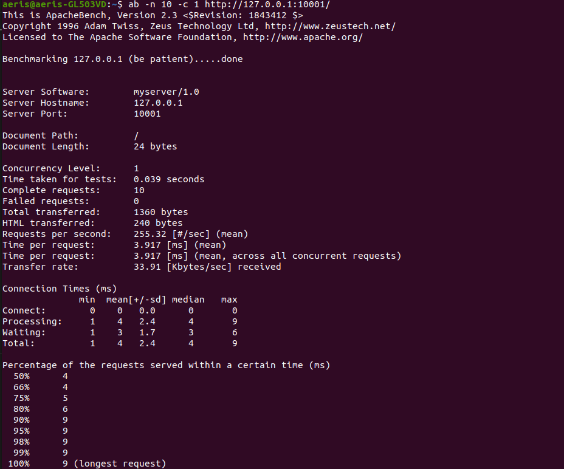

## Tugas 7 Pemrograman Jaringan

## Soal

## Summary
| No test | Concurrency level | Time taken for test (seconds) | Complete request | Failed request | Total transferred (bytes) | Request per second | Time per request (ms) | Transfer rate (Kbytes/sec) |
|:-------:|:-----------------:|:-----------------------------:|:----------------:|:--------------:|:-------------------------:|:------------------:|:---------------------:|:--------------------------:|
|1|1|0.039|10|0|1360|255.32|3.917|33.91|
||5|0.046|10|0|1360|216.63|23.081|28.77|
||10|0.082|10|0|1360|122.62|81.550|16.29|
|2|1|0.607|50|0|6800|82.41|12.134|10.95|
||10|0.663|50|0|6800|75.42|132.595|10.02|
||30|0.707|50|0|6800|70.73|424.177|9.39|
||50|0.846|50|0|6800|59.09|846.192|7.85|
|3|1|2.665|100|0|13600|37.52|26.650|4.98|
||10|7.853|100|0|13600|12.73|785.320|1.69|
||50|14.359|100|0|13600|6.96|7179.602|0.92|
||100|27.409|100|0|13600|3.65|27.409|0.48|

## 10 Request
### 1 Concurrency

### 5 Concurrency

### 10 Concurrency

## 50 Request
### 1 Concurrency

### 10 Concurrency

### 30 Concurrency

### 50 Concurrency

## 100 Request
### 1 Concurrency

### 10 Concurrency

### 50 Concurrency

### 100 Concurrency
