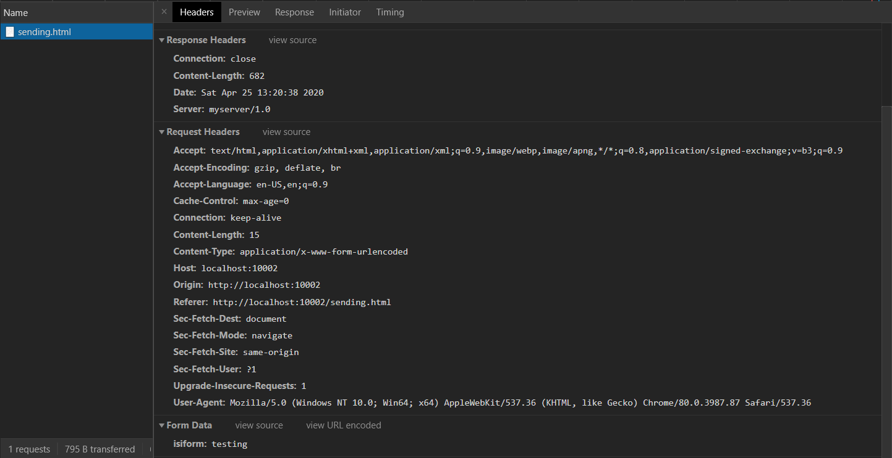

## Tugas 8 Pemrograman Jaringan

## Soal


## Modifikasi agar balasan server menjadi `header` dan `value form`
### Modifikasi fungsi post
```py
	def http_post(self,object_address,headers):
		isi=""
		for header in headers:
			# Form Data
			if "isiform" in header:
				val = header.split("=")
				header = "\nValue: " + val[1]
			# Request Header
			isi = isi + header + "\n"
		headers={}
		return self.response(200,'OK',isi,headers)
```
### Tampilan form

### Response pada browser



### Response pada server
