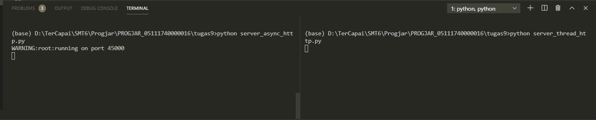
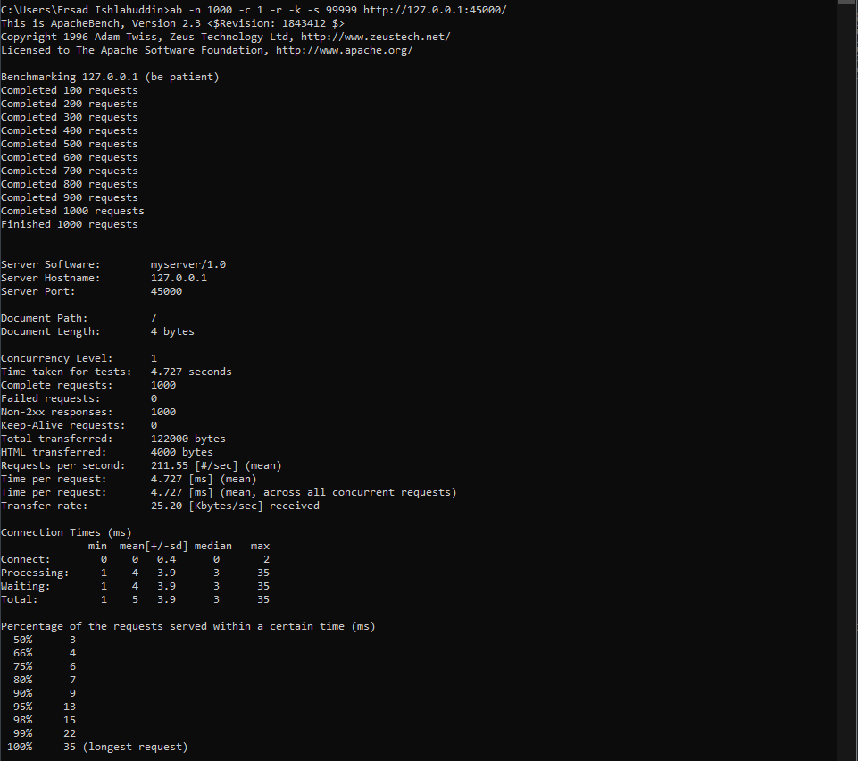
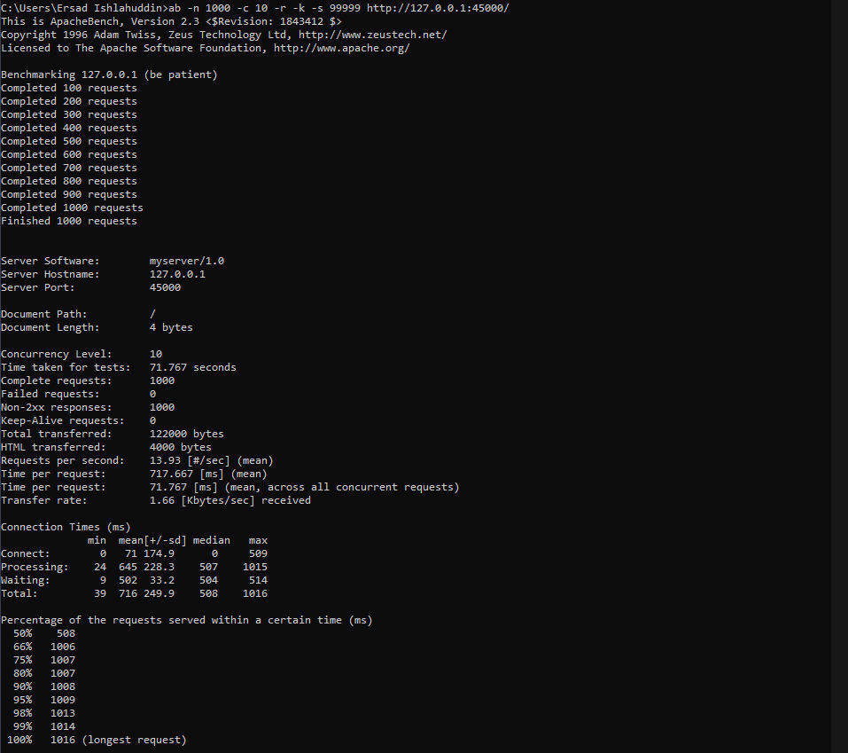
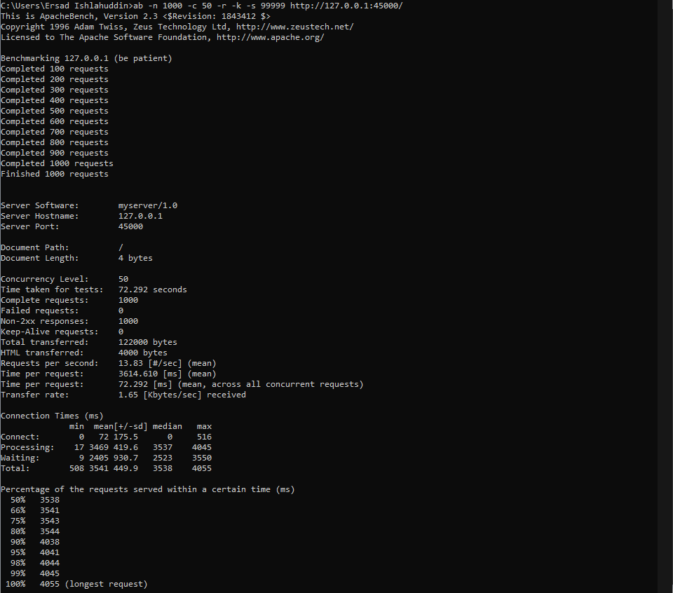
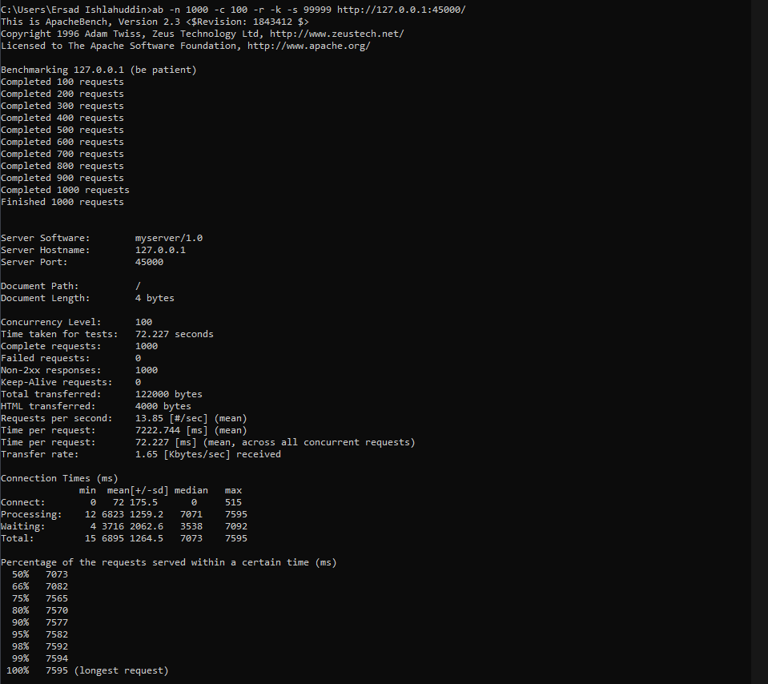
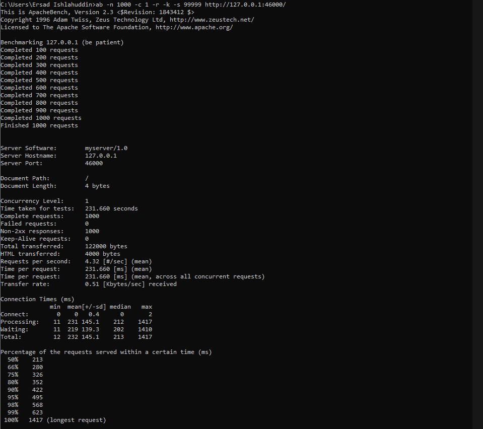
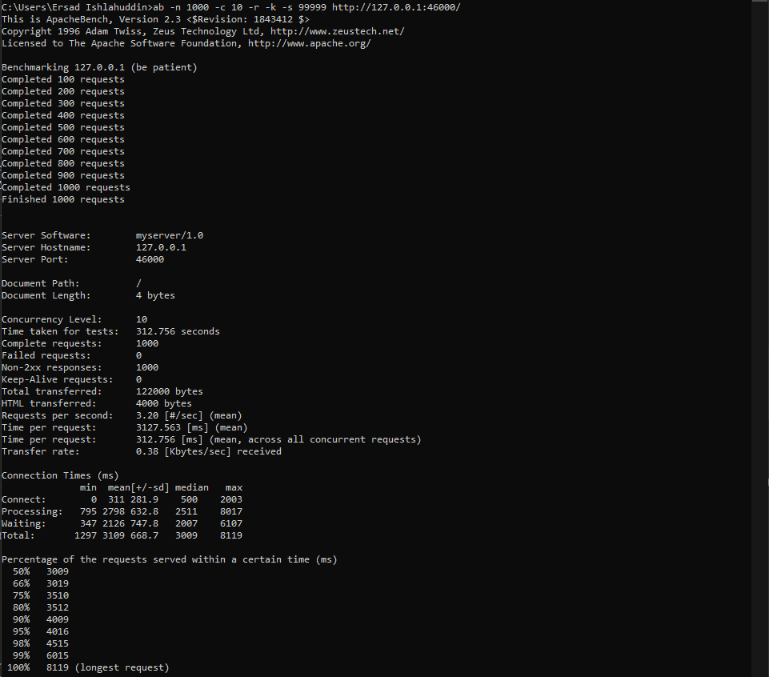
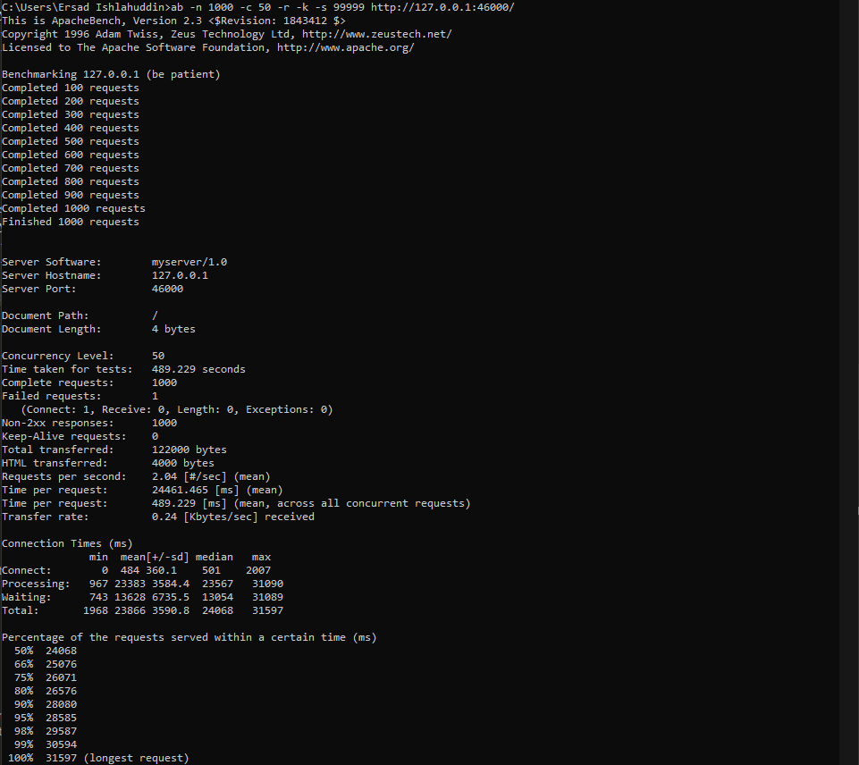
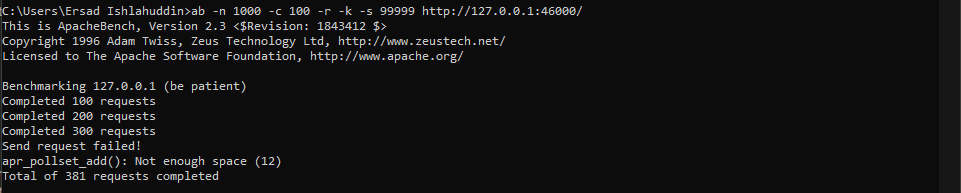

## Tugas 9 Pemrograman Jaringan

## Soal
1. Pull update terakhir
2. Jalankan kedua model tersebut
    * Server_async_http.py di port 45000
    * Server_thread_http.py di port 46000
3. Ujicobalah dengan apache benchmark untuk 1000 request dan konkurensi yang bervariasi
4. Buatlah tabel untuk melaporkan hasilnya

## Jalankan kedua model

## Ujicobalah dengan apache benchmark untuk 1000 request dan konkurensi yang bervariasi
1. server_async_http.py
    * ab -n 1000 -c 1 -r -k -s 99999 http://127.0.0.1:45000/
      
    * ab -n 1000 -c 10 -r -k -s 99999 http://127.0.0.1:45000/
      
    * ab -n 1000 -c 50 -r -k -s 99999 http://127.0.0.1:45000/
      
    * ab -n 1000 -c 100 -r -k -s 99999 http://127.0.0.1:45000/
      
2. server_thread_http.py
    * ab -n 1000 -c 1 -r -k -s 99999 http://127.0.0.1:46000/
      
    * ab -n 1000 -c 10 -r -k -s 99999 http://127.0.0.1:46000/
      
    * ab -n 1000 -c 50 -r -k -s 99999 http://127.0.0.1:46000/
      
    * ab -n 1000 -c 100 -r -k -s 99999 http://127.0.0.1:46000/
      

## Tabel
### server_async_http.py
| Concurrency level | Time taken for test (seconds) | Complete request | Failed request | Total transferred (bytes) | Request per second | Time per request (ms) | Transfer rate (Kbytes/sec) |
|:-------:|:-----------------:|:-----------------------------:|:----------------:|:--------------:|:-------------------------:|:------------------:|:---------------------:|:--------------------------:|
|1|4.727|1000|0|122000|211.55|4.727|25.20|
|10|71.767|1000|0|122000|13.93|717.667|1.66|
|50|72.292|1000|0|122000|13.83|3614.610|1.65|
|100|72.227|1000|0|122000|13.85|7222.744|1.65|
### server_thread_http.py
| Concurrency level | Time taken for test (seconds) | Complete request | Failed request | Total transferred (bytes) | Request per second | Time per request (ms) | Transfer rate (Kbytes/sec) |
|:-------:|:-----------------:|:-----------------------------:|:----------------:|:--------------:|:-------------------------:|:------------------:|:---------------------:|:--------------------------:|
|1|231.660|1000|0|122000|4.32|231.660|0.51|
|10|312.756|1000|0|122000|3.20|3127.563|0.38|
|50|489.229|1000|0|122000|2.04|24461.465|0.24|
|100|FAILED|381|619|FAILED|FAILED|FAILED|FAILED|
